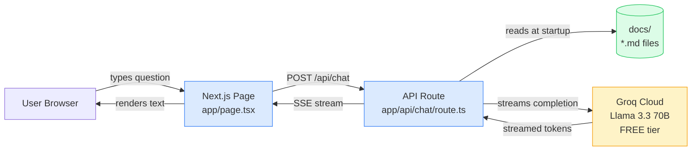
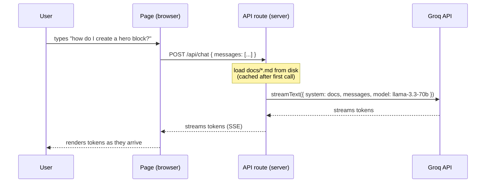

# v0.1 — "Works": Architecture & Design

> A docs chatbot for AEM EDS that answers questions in plain markdown.
> No generative UI yet. No vector DB. No npm package. Just one working thing.

---

## 1. Goal

Build the smallest possible useful thing: a web page where a user types a question about AEM EDS (aem.live docs) and gets a correct, sourced answer streamed back from an LLM.

**If a beginner can ask "how do I create a hero block?" and get a useful answer, v0.1 is done.**

---

## 2. Non-goals (explicitly out of scope for v0.1)

These are coming in v0.2 / v0.3 — do not build them now.

- ❌ Generative UI (custom React widgets) — v0.2
- ❌ Vector embeddings / semantic search — only if v0.1 hits context limits
- ❌ npm package abstraction (`defineChatbot` API) — v0.3
- ❌ Multiple LLM providers — only Groq for now
- ❌ Auth, rate limiting, analytics — not needed for a demo
- ❌ Chat history persistence — in-memory per session is fine

This list is the most important part of the doc. Every "let's also add..." should be checked against it.

---

## 3. High-level architecture



**The whole system is 3 pieces:**

| Piece | What it is | Why it's there |
|---|---|---|
| **UI** (`app/page.tsx`) | A React page with an input box and a list of messages. Uses `useChat` from Vercel AI SDK. | Shows messages, sends user input to the API. |
| **API route** (`app/api/chat/route.ts`) | A Next.js serverless function. Reads docs, calls Groq, streams the response. | Keeps the API key off the browser; lets us paste docs into the prompt. |
| **Docs** (`docs/*.md`) | 15–20 markdown files copy-pasted from aem.live. | The "knowledge" the bot answers from. |

That's it. Three pieces. No databases, no microservices, no embeddings.

---

## 4. Request flow (what happens when a user asks a question)



**Key idea:** the docs are pasted into the system prompt every request. Llama 3.3 has a 128k context window — 20 markdown pages fit easily. We only need RAG / embeddings if/when we exceed that.

---

## 5. Tech stack & justifications

| Layer | Choice | Why this and not something else |
|---|---|---|
| Framework | **Next.js 14 (App Router)** | One repo for UI + API. Free hosting on Vercel. Industry standard. |
| LLM library | **Vercel AI SDK (`ai`, `@ai-sdk/groq`)** | Free, minimal API, swap providers in one line later. |
| LLM provider | **Groq + Llama 3.3 70B** | Free tier, very fast, 128k context, no credit card required. |
| Language | **TypeScript** | Type safety helps a beginner; AI SDK is TS-first. |
| Styling | **Plain CSS / inline** for v0.1 | Don't pull in Tailwind etc. yet — keep deps minimal. |
| Deployment | **Vercel free tier** | One command: `vercel`. Auto-deploys from git. |

**Total cost: $0/month. No credit card needed anywhere.**

---

## 6. File layout

```
v0.1/
├── app/
│   ├── page.tsx                ← chat UI (React)
│   ├── layout.tsx              ← Next.js root layout
│   └── api/
│       └── chat/
│           └── route.ts        ← LLM call + doc loading
├── docs/                       ← AEM EDS markdown files (15-20)
│   ├── 01-component-model.md
│   ├── 02-blocks.md
│   └── ...
├── .env.example                ← GROQ_API_KEY=...
├── .env.local                  ← (gitignored) actual key
├── package.json
├── tsconfig.json
└── README.md                   ← how to run + screenshot
```

---

## 7. Success criteria (how we know v0.1 is done)

A reviewer can:

1. Clone the repo, run `npm install` and `npm run dev` with no errors.
2. Get a free Groq API key, paste into `.env.local`, restart.
3. Open localhost, ask "how do I create a hero block in EDS?" and receive a coherent, on-topic answer that references actual EDS concepts from the docs.
4. Ask 5 different questions and get 5 reasonable answers (no hallucinations about made-up APIs).
5. See the deployed version on Vercel at a public URL.

If all 5 pass, v0.1 ships. **Then** we plan v0.2 (gen UI).

---

## 8. Risks & how we'll handle them

| Risk | Likelihood | Mitigation |
|---|---|---|
| Groq rate-limits during demo | Medium | Free tier is generous (~30 req/min). Add a "bring your own key" input later if it bites. |
| 20 docs exceed 128k context | Low | Trim to 15 first. If still too big, switch to RAG in v0.1.5. |
| LLM hallucinates EDS APIs | Medium | Strong system prompt: "Answer ONLY using the provided documentation. If unsure, say so." |
| Docs get stale | Low (for v0.1) | Manual re-copy is fine. Automated scraping is a v0.3 problem. |

---

## 9. What v0.2 will add (preview, not for now)

- Generative UI: define one widget (`<BlockScaffolder />`) the LLM can render via tool calls.
- One demo video to share on social.
- Still no vector DB, still no package abstraction.

## 10. What v0.3 will add (preview, not for now)

- Extract into a publishable npm package: `defineChatbot({ sources, widgets, llm })`.
- Move v0.1 + v0.2 code into `examples/aem-docs/` showing the package in use.
- Publish to npm.

---

**Owner:** you. **Target:** 2 weekends. **Budget:** $0.
