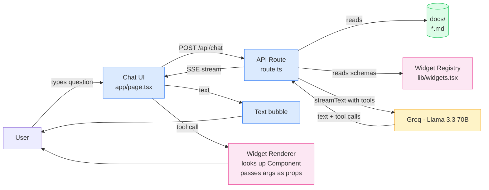
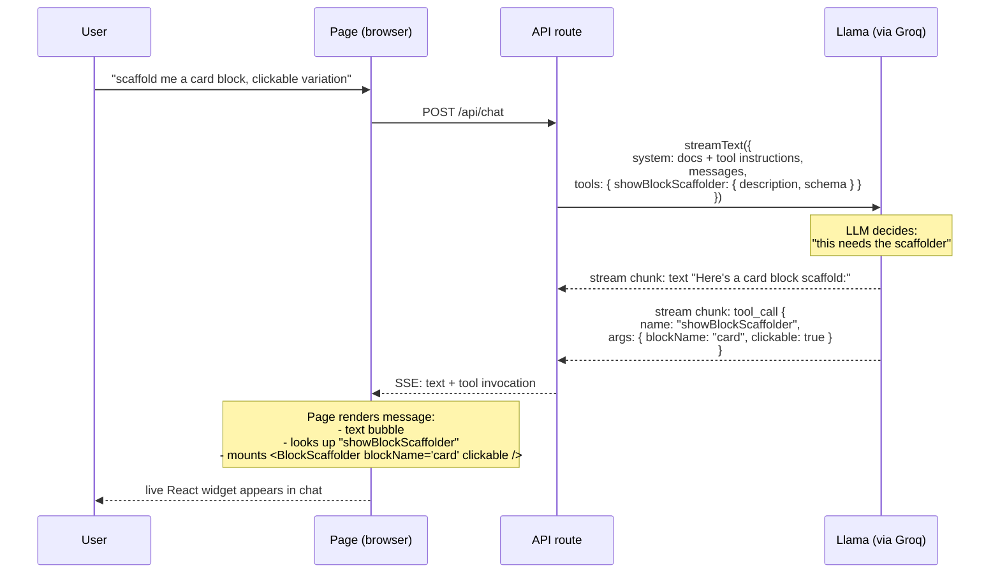

# v0.2 — "Interesting": Generative UI

> v0.1 answers in markdown. v0.2 can answer with **interactive React widgets** the LLM picks and fills in itself.
> One widget. One demo video. Still no embeddings, still no npm package — those come in v0.3.

---

## 1. Goal

When the user asks something a widget can answer better than text, the LLM should pick the right widget, decide its props, and have the UI render it inline in the chat.

Concrete example:

> User: *"scaffold me a card block with a clickable variation"*
>
> Bot replies with: a rendered `<BlockScaffolder>` component showing the folder layout, the `card.css` stub, the `card.js` stub with a working `decorate()` function, and a "Copy all" button — alongside a one-sentence text explanation.

If a beginner can ask that question and copy a working scaffold from the chat in <10 seconds, v0.2 is done.

---

## 2. Non-goals (still out of scope)

- ❌ More than one widget — `BlockScaffolder` only. Adding a second is just repetition; we want to prove the pattern works first.
- ❌ Vector embeddings / RAG — same docs-in-system-prompt approach as v0.1.
- ❌ npm package extraction — v0.3.
- ❌ Persistent chat history.
- ❌ Auth.

---

## 3. What changes from v0.1 (the diff)

| Layer | v0.1 | v0.2 |
|---|---|---|
| Chat UI (`app/page.tsx`) | Renders `m.content` only | Also renders `m.toolInvocations` → React components |
| API route (`app/api/chat/route.ts`) | `streamText({ system, messages })` | `streamText({ system, messages, tools })` |
| New file `lib/widgets.tsx` | — | Widget registry: `{ name → { schema, Component, description } }` |
| New file `components/BlockScaffolder.tsx` | — | The one demo widget |
| New dep | — | `zod` (for tool schemas) |
| System prompt | "answer from docs" | + "when the user asks for a block example, call the showBlockScaffolder tool" |

Everything else (Groq, Llama 3.3 70B, doc loading, layout) stays identical.

---

## 4. High-level architecture



The pink boxes are new in v0.2.

---

## 5. The tool-call flow (the new bit)

This is the heart of generative UI. Read it twice — it's the one thing that makes this version different from every markdown chatbot.



**Key idea:** the LLM never writes React code. It picks a widget by name and emits validated JSON props. The browser does the rendering. This means:

1. No security risk from "LLM-generated code." Props are validated against a Zod schema before the widget mounts.
2. Widgets are normal React components — they can use state, effects, click handlers, anything.
3. Adding a new widget = register it in `lib/widgets.tsx`, the LLM gets it for free in the next request.

---

## 6. The widget registry pattern

This is the API shape that v0.3's npm package will eventually expose. Building it now (in-app) gives us a chance to feel the ergonomics.

```ts
// v0.2/lib/widgets.tsx
import { z } from 'zod'
import { BlockScaffolder } from '@/components/BlockScaffolder'

export const widgets = {
  showBlockScaffolder: {
    description:
      'Generate a starter scaffold for an EDS block. Use when the user asks for a code example, a starter template, or "how to create" a specific block.',
    schema: z.object({
      blockName: z.string().describe('The block name in kebab-case, e.g. "hero", "card-grid"'),
      includeCss: z.boolean().default(true),
      clickable: z.boolean().default(false).describe('Whether the block should be wrapped in a click handler'),
    }),
    Component: BlockScaffolder,
  },
} as const
```

Three things this gives us:

- **The `description`** is what the LLM reads to decide *whether* to call the widget. Phrase it as a use-case, not a feature.
- **The `schema`** is what the LLM reads to decide *what props to fill in*. The `.describe()` hints help massively.
- **The `Component`** is a normal React component. The browser uses it to render once the LLM has emitted props.

---

## 7. The widget itself

`BlockScaffolder` is intentionally a real, useful tool — not a toy. It should:

1. Render the file structure (`/blocks/<name>/<name>.css`, `<name>.js`).
2. Render syntax-highlighted code stubs for both files.
3. If `clickable: true`, the JS includes a working click handler stub.
4. Have a "Copy all files" button that copies a multi-file format the user can paste into their editor.
5. Look like a real component, not a wireframe — small visual polish goes a long way for the demo video.

```tsx
// v0.2/components/BlockScaffolder.tsx (sketch)
export function BlockScaffolder({ blockName, includeCss = true, clickable = false }: Props) {
  const cssCode = `.${blockName} { /* styles for ${blockName} */ }`
  const jsCode = clickable
    ? `export default function decorate(block) {\n  block.addEventListener('click', () => { /* … */ })\n}`
    : `export default function decorate(block) {\n  block.classList.add('decorated')\n}`
  return (
    <div className="scaffolder">
      <header>📁 /blocks/{blockName}/</header>
      {includeCss && <FileBlock name={`${blockName}.css`} lang="css" code={cssCode} />}
      <FileBlock name={`${blockName}.js`} lang="js" code={jsCode} />
      <button onClick={copyAll}>Copy all files</button>
    </div>
  )
}
```

---

## 8. File layout (only the diff vs v0.1)

```
v0.2/
├── app/
│   ├── api/chat/route.ts      ← + tools parameter, + tool description in system prompt
│   ├── layout.tsx             ← unchanged
│   └── page.tsx               ← + render m.toolInvocations via widget registry
├── components/
│   └── BlockScaffolder.tsx    ← NEW
├── lib/
│   └── widgets.tsx            ← NEW (the registry)
├── docs/                       ← copied from v0.1, optionally trimmed
├── package.json               ← + zod dependency
└── (everything else identical to v0.1)
```

---

## 9. Success criteria (how we know v0.2 is done)

1. `npm install` and `npm run dev` work in `v0.2/` with no errors.
2. Asking *"how do I create a hero block?"* still gives a markdown answer (text-only path still works).
3. Asking *"scaffold a card block"* renders the `<BlockScaffolder>` widget inline with `blockName="card"`.
4. Asking *"give me a clickable hero block scaffold"* renders the widget with `blockName="hero"` AND `clickable: true`. (Tests that the LLM fills in props correctly.)
5. The "Copy all files" button works.
6. A 60-second screen recording demonstrates 3 + 4 + 5 — this is the launch asset.

---

## 10. Risks & mitigations

| Risk | Mitigation |
|---|---|
| Llama 3.3 70B isn't great at picking tools | Phrase the `description` as a use-case ("call this when user asks for…"). If it still misses, switch to `llama-3.1-70b-versatile` or test with `gpt-oss-120b` on Groq. |
| Tool calls don't stream cleanly via `useChat` | Use AI SDK v4+. Tool invocations land in `m.toolInvocations` after streaming completes. Render text first, widget when it lands. |
| Widget renders with bad props | Zod schema validates at API boundary; bad calls get a friendly error message instead of a crash. |
| Adding tool descriptions blows up the system prompt | Negligible at one widget. Revisit at 10+. |

---

## 11. What v0.3 will add (still planned, not now)

- Extract `lib/widgets.tsx` + the registry-driven route handler into a publishable package.
- A `defineChatbot({ sources, widgets, llm })` config API.
- Demo project becomes `examples/aem-docs/` — a user of the package, not the package itself.

---

**Owner:** you. **Target:** 1–2 weekends. **Budget:** $0. **Launch asset:** a 60s video.
